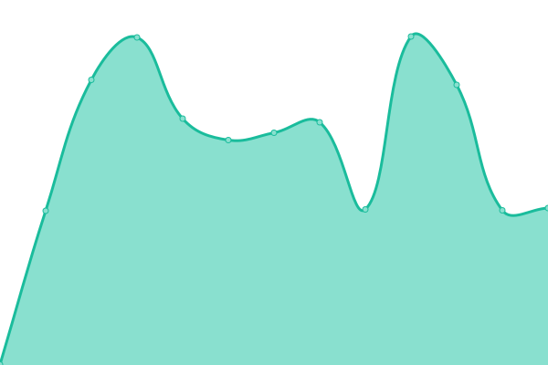

# [📈 Live Status](https://status.pantagruweb.club): <!--live status--> **🟧 Partial outage**

This repository contains the open-source uptime monitor and status page for [Constructions Incongrues](https://constructions-incongrues.net), powered by [Upptime](https://github.com/upptime/upptime).

With [Upptime](https://upptime.js.org), you can get your own unlimited and free uptime monitor and status page, powered entirely by a GitHub repository. We use [Issues](https://github.com/constructions-incongrues/status-pantagruweb/issues) as incident reports, [Actions](https://github.com/constructions-incongrues/status-pantagruweb/actions) as uptime monitors, and [Pages](https://status.pantagruweb.club) for the status page.

<!--start: status pages-->
<!-- This summary is generated by Upptime (https://github.com/upptime/upptime) -->
<!-- Do not edit this manually, your changes will be overwritten -->
<!-- prettier-ignore -->
| URL | Status | History | Response Time | Uptime |
| --- | ------ | ------- | ------------- | ------ |
|  [Home](https://pantagruweb.club) | 🟥 Down | [home.yml](https://github.com/constructions-incongrues/status-pantagruweb/commits/HEAD/history/home.yml) | 

 500ms
     
 | 

<a href="https://status.pantagruweb.club/history/home">0.00%</a>
    

|  [Archive](https://archive.pantagruweb.club/identity) | 🟩 Up | [archive.yml](https://github.com/constructions-incongrues/status-pantagruweb/commits/HEAD/history/archive.yml) | 

 588ms
     
 | 

<a href="https://status.pantagruweb.club/history/archive">100.00%</a>
    

|  [Hello](https://hello.pantagruweb.club/login) | 🟩 Up | [hello.yml](https://github.com/constructions-incongrues/status-pantagruweb/commits/HEAD/history/hello.yml) | 

 464ms
     
 | 

<a href="https://status.pantagruweb.club/history/hello">19.80%</a>
    

|  [Panurge](https://panurge.pantagruweb.club) | 🟩 Up | [panurge.yml](https://github.com/constructions-incongrues/status-pantagruweb/commits/HEAD/history/panurge.yml) | 

 459ms
     
 | 

<a href="https://status.pantagruweb.club/history/panurge">100.00%</a>
    

|  [Stats](https://stats.pantagruweb.club) | 🟥 Down | [stats.yml](https://github.com/constructions-incongrues/status-pantagruweb/commits/HEAD/history/stats.yml) | 

 0ms
     
 | 

<a href="https://status.pantagruweb.club/history/stats">12.00%</a>
    

|  [Téloche](https://teloche.pantagruweb.club) | 🟩 Up | [teloche.yml](https://github.com/constructions-incongrues/status-pantagruweb/commits/HEAD/history/teloche.yml) | 

 599ms
     
 | 

<a href="https://status.pantagruweb.club/history/teloche">100.00%</a>
    

<!--end: status pages-->

[**Visit our status website →**](https://status.pantagruweb.club)

## 📄 License

- Powered by: [Upptime](https://github.com/upptime/upptime)
- Code: [MIT](./LICENSE) © [Anand Chowdhary](https://anandchowdhary.com), supported by [Pabio](https://pabio.com)
- Data in the `./history` directory: [Open Database License](https://opendatacommons.org/licenses/odbl/1-0/)
